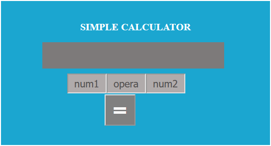
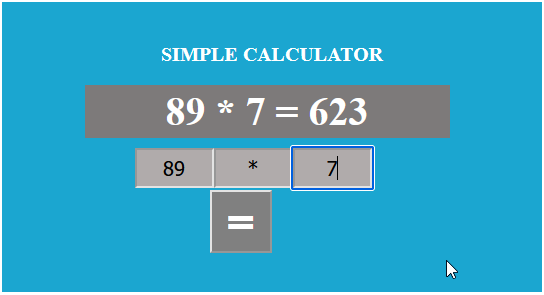
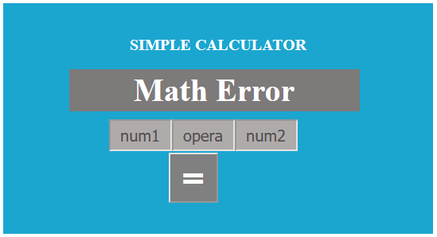

## SIMPLE CALCULATOR

This is a small calculator APP created in python using the pyscript framework.
The APP can perform below arithmatic calcualtion
+ Addition. 
+ Subtitution.
+ Division.
+ Multiplication

The APP checks if you have entered a digit and perform the calculation for you.
If you enter any thing apart from a number, then it throws `Math Error`.

At the moment, the APP dose not work with decimals.

## First time lunch of APP

## Program run without error input

## Program run with error input

